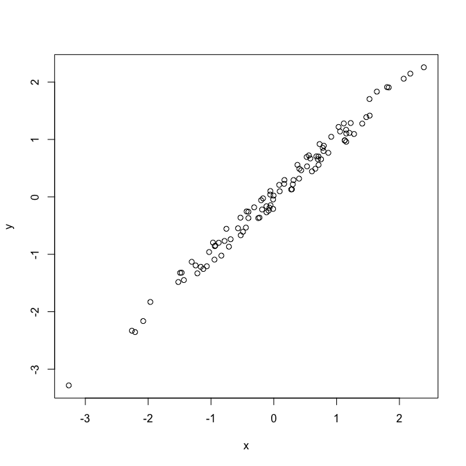
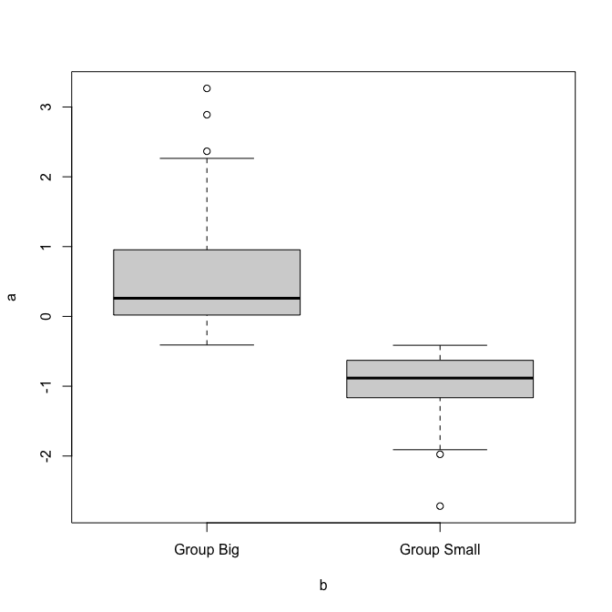

^1^ Data Science Institute, University of Arizona, Tucson AZ, U.S.A

`*` Corresponding author: gchism@arizona.edu

# ABSTRACT

Write your abstract here.

*Keywords*: Rmarkdown, reproducible science

# INTRODUCTION

Write your introduction here. You can cite bibliography like this [@Yan2011; @Sutherland2011] if you provide a `BibTeX` file with references. See http://rmarkdown.rstudio.com for more information. 

You can even specify the desired output format for your bibliography by including a style file for a specific journal (e.g. "ecology.csl"). Many different bibliography styles (CSL files) can be obtained at http://citationstyles.org/, https://github.com/citation-style-language/styles, or https://zotero.org/styles.

# METHODS

## Study Area

We worked in a **beautiful** place with lots of trees, like *Quercus suber* and *Laurus nobilis*.

## Data collection and analysis

We applied a linear model where

$$
y_{i} = \alpha + \beta*x_{i} 
$$

We used the statistical language `R` [@R_Core_Team_2021] for all our analyses. These were implemented in dynamic rmarkdown documents using `knitr` [@Xie_2022; @Xie_2015; @Xie_2014] and `rmarkdown` [@Allaire_2022; @Xie_2018; @Xie_2020] packages. All the multilevel models were fitted with `lme4` [@Bates_2015]. 

# RESULTS

Trees in forest *A* grew taller than those in forest *B* (mean height: 25 versus 13 m). 

And many more cool results that get updated dynamically, e.g. see Table <a href="#tab:Table-mtcars">2</a> and Fig. <a href="#fig:scatterplot">1</a>. Note Tables and Figures are cross-linked and numbered automatically. 

Table: Table 1: A glimpse of the famous Iris dataset.

| Sepal.Length| Sepal.Width| Petal.Length| Petal.Width|Species |
|------------:|-----------:|------------:|-----------:|:-------|
|          5.1|         3.5|          1.4|         0.2|setosa  |
|          4.9|         3.0|          1.4|         0.2|setosa  |
|          4.7|         3.2|          1.3|         0.2|setosa  |
|          4.6|         3.1|          1.5|         0.2|setosa  |
|          5.0|         3.6|          1.4|         0.2|setosa  |
|          5.4|         3.9|          1.7|         0.4|setosa  |

# DISCUSSION

Discuss.

# CONCLUSIONS

Wrap up

# ACKNOWLEDGEMENTS

On the shoulders of giants.

# REFERENCES

::: {#refs}
:::

\newpage

# Supplementary Table (on new page)

Table: Table 2: Now a subset of mtcars dataset.

|                    |  mpg| cyl|  disp|  hp| drat|    wt|  qsec| vs| am| gear| carb|
|:-------------------|----:|---:|-----:|---:|----:|-----:|-----:|--:|--:|----:|----:|
|Merc 280            | 19.2|   6| 167.6| 123| 3.92| 3.440| 18.30|  1|  0|    4|    4|
|Merc 280C           | 17.8|   6| 167.6| 123| 3.92| 3.440| 18.90|  1|  0|    4|    4|
|Merc 450SE          | 16.4|   8| 275.8| 180| 3.07| 4.070| 17.40|  0|  0|    3|    3|
|Merc 450SL          | 17.3|   8| 275.8| 180| 3.07| 3.730| 17.60|  0|  0|    3|    3|
|Merc 450SLC         | 15.2|   8| 275.8| 180| 3.07| 3.780| 18.00|  0|  0|    3|    3|
|Cadillac Fleetwood  | 10.4|   8| 472.0| 205| 2.93| 5.250| 17.98|  0|  0|    3|    4|
|Lincoln Continental | 10.4|   8| 460.0| 215| 3.00| 5.424| 17.82|  0|  0|    3|    4|

\newpage

# Supplementary Figure (on new page)

